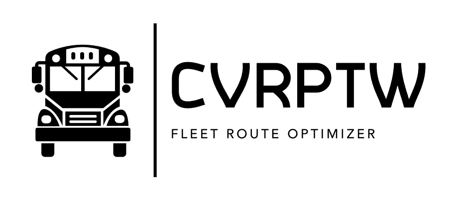
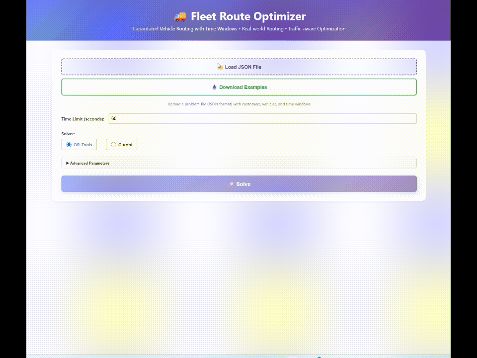

<div align="center">
  
</div>

<h1 align="center"> Fleet Route Optimizer [CVRPTW]</h1>

<div align="center">


</div>

> **Capacitated Vehicle Routing Problem with Time Windows** - An advanced optimization system for logistics and delivery route planning

> ⚠️ **Note**: This is a production-ready project with clean architecture, demonstrating professional vehicle routing optimization techniques.

## 📋 Overview

Fleet Route Optimizer is a comprehensive web-based application for solving complex vehicle routing problems with constraints including:

- **Vehicle Capacity**: Each vehicle has a maximum load capacity
- **Time Windows**: Deliveries must be made within specific time slots
- **Fleet Optimization**: Minimize number of vehicles while maximizing utilization
- **Real Distance Matrix**: Uses actual travel distances and times (morning/afternoon/evening traffic)
- **Dynamic Service Time**: Calculated based on delivery size (10 min + 2 min per unit)

### ✨ Key Features

- 🎯 **Two Solver Engines**: OR-Tools (open-source) and Gurobi (commercial)
- 📊 **Interactive Web UI**: Real-time visualization and route management
- 🗺️ **Map Integration**: Visual representation of routes on interactive maps
- 💾 **Distance Cache**: Persistent storage to avoid redundant calculations
- 🌐 **Real Distance Matrix**: OSRM routing service for accurate travel times
- 🕐 **Time-Based Routing**: Different travel times for morning/afternoon/evening traffic
- 📈 **Detailed Analytics**: Comprehensive metrics and statistics
- 🐳 **Docker Support**: Easy deployment with Docker Compose
- 🏗️ **Clean Architecture**: Modular, maintainable, and scalable codebase
- 🔄 **Server-Sent Events**: Real-time log streaming during optimization
- 🎨 **Pydantic Models**: Type-safe data validation and serialization

<div align="center">
  
</div>

## 🏗️ Project Structure

```
solver/
├── src/                         # Source code (refactored architecture)
│   ├── api/                     # API Layer - HTTP endpoints
│   │   ├── __init__.py
│   │   └── routes.py            # FastAPI routes (health, solve, solve-stream, download)
│   │
│   ├── core/                    # Core Layer - Business logic
│   │   ├── __init__.py
│   │   └── solvers/             # Solver implementations
│   │       ├── __init__.py
│   │       ├── base.py          # Abstract BaseSolver + SolverType enum
│   │       ├── factory.py       # SolverFactory (Factory Pattern)
│   │       ├── ortools_solver.py    # OR-Tools wrapper
│   │       ├── ortools_impl.py      # OR-Tools implementation
│   │       ├── gurobi_solver.py     # Gurobi wrapper
│   │       └── gurobi_impl.py       # Gurobi implementation
│   │
│   ├── models/                  # Data Models Layer
│   │   ├── __init__.py
│   │   ├── domain.py            # Domain models (15+ Pydantic models)
│   │   │                        # Location, Customer, Vehicle, Route, etc.
│   │   └── api.py               # API request/response models
│   │
│   ├── services/                # Service Layer - Business logic orchestration
│   │   ├── __init__.py
│   │   ├── distance_cache.py    # Distance/time caching with OSRM
│   │   ├── problem_builder.py   # Problem construction from JSON
│   │   └── solver_service.py    # Main solver orchestration
│   │
│   ├── utils/                   # Utilities Layer
│   │   ├── __init__.py
│   │   ├── distance_calculator.py  # Haversine & Euclidean distance
│   │   └── time_formatter.py       # Time formatting utilities
│   │
│   ├── config/                  # Configuration Layer
│   │   ├── __init__.py
│   │   ├── settings.py          # Pydantic BaseSettings (env-based config)
│   │   └── logging.py           # Centralized logging configuration
│   │
│   ├── app.py                   # FastAPI application entry point
│   └── __init__.py
│
├── webui/                       # React Frontend
│   ├── src/
│   │   ├── components/
│   │   ├── pages/
│   │   └── App.js
│   ├── public/
│   └── package.json
│
├── inputs/                      # Example input JSON files
│   ├── CVRPTW_SMALL.json
│   ├── CVRPTW_MEDIUM.json
│   └── CVRPTW_LARGE.json
│
├── results/                     # Solution output files
├── docker/                      # Docker configuration
│   ├── docker-compose.yml
│   └── README.md
│
├── requirements.txt             # Python dependencies
├── .env.example                 # Environment configuration template
├── Dockerfile
└── README.md
```

### 🎯 Architecture Highlights

The project follows **Clean Architecture** principles with clear separation of concerns:

1. **API Layer** (`src/api/`): HTTP endpoints, request/response handling
2. **Core Layer** (`src/core/`): Solver implementations, business rules
3. **Service Layer** (`src/services/`): Orchestration, workflow management
4. **Models Layer** (`src/models/`): Type-safe data structures with Pydantic
5. **Utils Layer** (`src/utils/`): Reusable helper functions
6. **Config Layer** (`src/config/`): Environment-based configuration

**Design Patterns Used:**
- ✅ Factory Pattern (SolverFactory)
- ✅ Service Layer Pattern
- ✅ Repository Pattern (DistanceCache)
- ✅ Dependency Injection
- ✅ Abstract Base Classes


## 🚀 Quick Start

### Prerequisites

- Python 3.10+
- Node.js 18+ (for Web UI)
- (Optional) Gurobi license for Gurobi solver

### Installation

1. **Clone the repository**:
```bash
git clone <repository-url>
cd solver
```

2. **Create virtual environment**:
```bash
python -m venv venv
# Windows
.\venv\Scripts\activate
# Linux/Mac
source venv/bin/activate
```

3. **Install dependencies**:
```bash
pip install -r requirements.txt
```

4. **Configure environment** (optional):
```bash
cp .env.example .env
# Edit .env with your settings (API_TITLE, PORT, DEFAULT_SOLVER, etc.)
```

5. **Run the API server**:
```bash
# Recommended: New modular architecture
python -m src.app

# Alternative: Using uvicorn directly
uvicorn src.app:app --port 8000 --reload

# Note: Old server.py has been deprecated and removed
```

6. **Run the Web UI** (separate terminal):
```bash
cd webui
npm install
npm start
```

7. **Access the application**:
- Web UI: http://localhost:3000
- API Docs (Swagger): http://localhost:8000/docs
- API Docs (ReDoc): http://localhost:8000/redoc

## 📚 API Endpoints

### 1. Health Check

```bash
GET /health

Response:
{
  "status": "ready",  # or "busy" if solver is running
  "message": null
}
```

### 2. Solve Problem (Standard)

```bash
POST /solve?time_limit=60&solver=ortools&vehicle_penalty_weight=100000&distance_weight=1.0
Content-Type: application/json

{
  "date": "2025-01-15",
  "depot": {
    "location": [45.464, 9.190]
  },
  "vehicles": [
    {
      "id": "V1",
      "capacity_units": 33,
      "time_window": {
        "start_min": 240,
        "end_min": 1260
      }
    }
  ],
  "customers": [
    {
      "id": "C1",
      "name": "Customer 1",
      "location": [45.470, 9.200],
      "demand_units": 10,
      "time_window": {
        "start_min": 480,
        "end_min": 720
      }
    }
  ]
}

Response: Complete solution with routes, metrics, and timeline
```

### 3. Solve with Real-time Streaming (SSE)

```bash
POST /solve-stream?time_limit=60&solver=ortools
Content-Type: application/json

# Same payload as /solve

Response: Server-Sent Events stream with logs and final result
Events:
- {"type": "log", "message": "Starting solver..."}
- {"type": "log", "message": "Building model..."}
- {"type": "result", "data": {...}}
```

### 4. Download Example Files

```bash
GET /download-examples

Response: ZIP file with CVRPTW_SMALL.json, CVRPTW_MEDIUM.json, CVRPTW_LARGE.json
```

### Query Parameters

| Parameter | Type | Default | Description |
|-----------|------|---------|-------------|
| `time_limit` | int | 60 | Time limit in seconds (1-3600) |
| `solver` | str | "ortools" | Solver type: "ortools" or "gurobi" |
| `vehicle_penalty_weight` | float | Auto | Weight for minimizing vehicles (OR-Tools: 100000, Gurobi: 1000) |
| `distance_weight` | float | 1.0 | Weight for distance minimization |
| `mip_gap` | float | 0.01 | MIP optimality gap for Gurobi (1% default) |

## ⚙️ Configuration

Configuration is managed through environment variables (`.env` file) or `src/config/settings.py`:

| Variable | Default | Description |
|----------|---------|-------------|
| `APP_NAME` | "Fleet Route Optimizer API" | Application name |
| `API_HOST` | 127.0.0.1 | API server host |
| `API_PORT` | 8000 | API server port |
| `DEBUG` | false | Debug mode |
| `DEFAULT_SOLVER` | ortools | Default solver (ortools/gurobi) |
| `ORTOOLS_VEHICLE_PENALTY` | 100000.0 | OR-Tools vehicle penalty weight |
| `GUROBI_VEHICLE_PENALTY` | 1000.0 | Gurobi vehicle penalty weight |
| `DISTANCE_CACHE_DB` | distance_cache.db | SQLite database path |
| `OSRM_BASE_URL` | http://router.project-osrm.org | OSRM API base URL |
| `LOG_LEVEL` | INFO | Logging level |

## 🔧 Development

### Adding a New Solver

1. Create implementation in `src/core/solvers/newsolver_impl.py`
2. Create wrapper in `src/core/solvers/newsolver_solver.py` extending `BaseSolver`
3. Add solver type to `SolverType` enum in `base.py`
4. Register in `SolverFactory` in `factory.py`

### Project Structure Best Practices

The refactored structure follows Python best practices:

- **Modular Design**: Each module has a single responsibility
- **Type Hints**: Comprehensive type annotations throughout
- **Pydantic Models**: Strong data validation and serialization
- **Dependency Injection**: Services are injected, not hard-coded
- **Configuration Management**: Centralized, environment-aware settings
- **Logging**: Structured logging with configurable levels
- **Error Handling**: Comprehensive error handling with proper HTTP status codes

### Adding a New Solver

1. Create solver class in `src/core/solvers/`:
```python
from .base import BaseSolver

class MySolver(BaseSolver):
    def solve(self, **kwargs):
        # Implementation
        pass
```

2. Register in factory (`src/core/solvers/factory.py`):
```python
elif solver_type_lower == "mysolver":
    return MySolver(problem)
```

## 📦 Dependencies

### Core Dependencies

- **FastAPI** (0.121.0+): Modern web framework
- **Pydantic** (2.0+): Data validation and settings
- **pydantic-settings** (2.0+): Environment-based configuration
- **OR-Tools** (9.7+): Constraint programming solver
- **Gurobi** (11.0+): Commercial optimization solver (optional)
- **python-dotenv** (1.0+): Environment variable management
- **uvicorn**: ASGI server
- **pandas**: Data manipulation
- **requests**: HTTP client for OSRM

### Development Dependencies

All dependencies are listed in `requirements.txt`. Install with:

```bash
pip install -r requirements.txt
```

## 🐳 Docker Deployment

```bash
# Build and run with Docker Compose
cd docker
docker-compose up --build

# Access services
# API: http://localhost:8000
# Web UI: http://localhost:3000

# Note: Update docker-compose.yml to use src.app:app instead of src.server:app
```

## 📊 Performance Considerations

- **Distance Cache**: Uses SQLite to cache OSRM API calls, drastically reducing API requests
- **Traffic Patterns**: Adjusts travel times based on delivery time windows (morning/afternoon/evening)
- **Service Time**: Dynamic calculation based on delivery size (10 min base + 2 min per unit)
- **Solver Selection**: OR-Tools for speed, Gurobi for optimality
- **Modular Architecture**: Improved maintainability and testability
- **Type Safety**: Pydantic models ensure data integrity

## 🤝 Contributing

Contributions are welcome! Please:

1. Fork the repository
2. Create a feature branch (`git checkout -b feature/amazing-feature`)
3. Follow the existing code structure and style
4. Add type hints and docstrings
5. Update tests if applicable
6. Commit your changes (`git commit -m 'Add amazing feature'`)
7. Push to the branch (`git push origin feature/amazing-feature`)
8. Submit a pull request

### Code Style

- Follow PEP 8 guidelines
- Use type hints for all functions
- Add comprehensive docstrings
- Keep functions small and focused
- Use Pydantic models for data validation

## 📄 License

This project is licensed under the MIT License - see the [LICENSE](LICENSE) file for details.

## 🙏 Acknowledgments

- **Google OR-Tools**: Powerful open-source optimization library
- **Gurobi**: Industry-leading mathematical optimization solver
- **OSRM**: Open Source Routing Machine for real-world routing data
- **FastAPI**: Modern, fast web framework for building APIs
- **React**: Frontend library for building user interfaces
- **Pydantic**: Data validation using Python type annotations

## 📞 Support

For questions, issues, or suggestions:
- 📝 Open an issue on GitHub

## 🚀 Roadmap

- [ ] Complete unit test coverage
- [ ] Add integration tests
- [ ] Add more solver engines (e.g., LocalSolver, HGS-CVRP)
- [ ] WebSocket support for real-time updates
- [ ] Enhanced map visualization
- [ ] Multi-depot support
- [ ] Vehicle type constraints

---

<div align="center">

**Fleet Route Optimizer [CVRPTW]**

Made with ❤️ for logistics optimization

🚚 Clean Architecture • 🏗️ Modular Design • ⚡ High Performance

</div>
